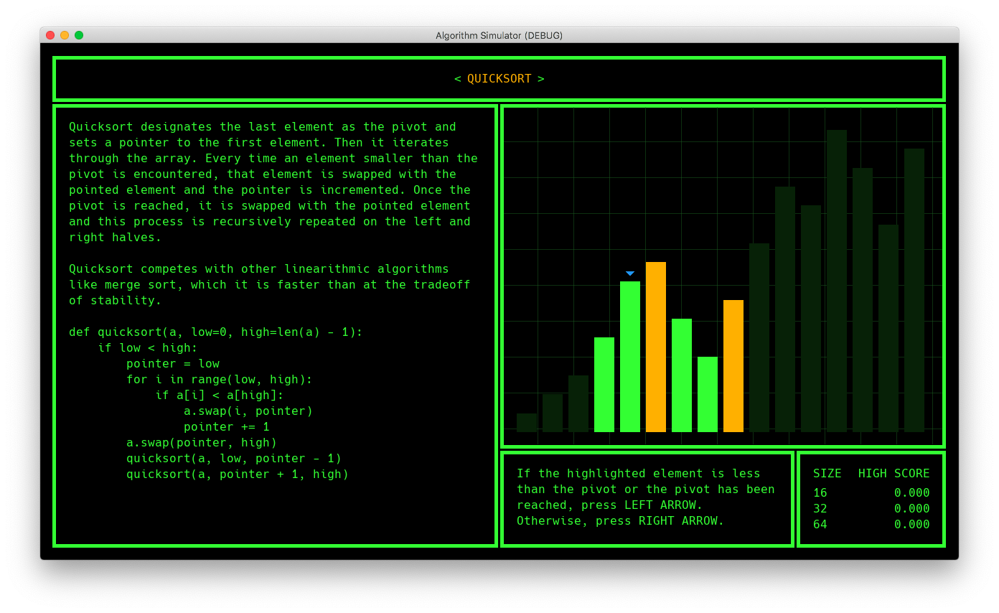

 

  

  <h1 align="center">Human Computer Simulator</h1>

  

    A game where you get to become your favorite algorithm or data structure!
     
    <a href="https://github.com/DanielZTing/human-computer-simulator/issues/new?template=bug_report.md">Report Bug</a>
    ·
    <a href="https://github.com/DanielZTing/human-computer-simulator/issues/new?template=feature_request.md">Request Feature</a>
  

## Table of Contents

* [About the Project](#about-the-project)
* [Getting Started](#getting-started)

## About The Project

You may have come across the famous [15 Sorting Algorithms in 6 Minutes](https://www.youtube.com/watch?v=kPRA0W1kECg) video by [Timo Bingoman](https://github.com/bingmann) at some point in your computer science career. There is currently no shortage of neat visualizations of all kinds of algorithms, but what if you could become the algorithm itself?

In *Human Computer Simulator*, you control an algorithm operating on some data structure. Right now, the game is limited to sorting arrays. The end vision is to have a library of interactive, playable levels on anything from a search on a binary tree to Dijkstra's shortest path on a graph.

It's written using the Godot game engine and licensed with [almost no restrictions](LICENSE.txt). Use it to make a lecture a bit more interesting, review for an assignment, or just kill time. Hope you enjoy.

## Getting Started

This software is in an alpha stage of development and I do not plan on releasing ready-to-run builds until a stable v1.0 release. However, it is very easy to run and hack the source code yourself. Just grab the lightweight free and open source [Godot game engine](https://godotengine.org/download), import the `project.godot` file, and hit the play button.

A demo version (large download warning: ~20 MB) is available on this repository's [Github Pages](https://danielzting.github.io/human-computer-simulator). It requires a desktop browser with support for WebAssembly and WebGL; mobile is not currently supported. Since this is still in alpha, some things might be dumb, make no sense whatsoever, or just break outright. I welcome any feedback you may have.
